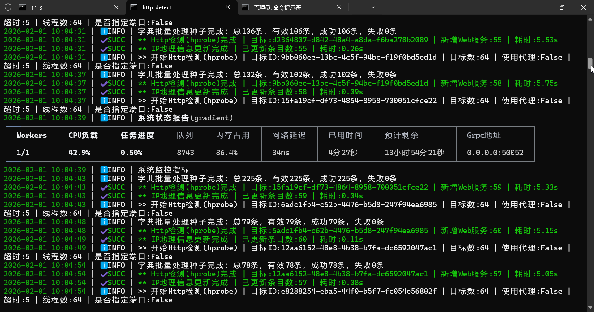

# Hprobe 🚀 [](https://github.com/FlyfishSec/hprobe)

A high-performance HTTP probing tool for asset discovery.

`hprobe` 是一个高性能 HTTP 探测引擎，基于 Rust 实现，并通过 Python 提供简单易用接口。
它支持同步和异步调用，能够快速探测目标 HTTP 服务、端口、指纹等，适用于大规模资产发现/网络空间测绘。

- 跨平台（Linux / Windows / macOS）  
- 支持多线程和异步模式  
- 可统一全局配置，方便批量调用  
- 提供参数化和字典配置两种接口

🔗 **GitHub:** [https://github.com/FlyfishSec/hprobe-python](https://github.com/FlyfishSec/hprobe-python)

---

## Core Advantages 📌| 核心优势

1. **Tokio 异步运行时，极致高并发**
   - 基于 Tokio 异步运行时构建，充分利用多核性能，支撑大规模高并发探测

2. **纳秒级 ASN 查询**  
   - 自定义二进制结构体，采用零拷贝设计 + mmap 内存映射 + 二分查找，实现纳秒级 ASN 信息查询

3. **极速 Web 指纹识别**  
   - 集成 17000 + 指纹规则，进程内单例懒加载，10MB HTML 毫秒级指纹识别

## Quick Start⚡| 快速开始

```bash
# PyPI 安装（Python >=3.7）
pip install hprobe
```

### 示例1 同步快速调用(配置字典调用)

```python
import hprobe

# 核心配置
CORE_CONFIG = {
    # 目标支持ip/domain/url，示例：192.168.1.1/example.com/192.168.1.1:443/https://example.com
    "target": "example.com",  # 必选
    "ports": [80, 443],       # 可选：探测端口，不填则使用自动端口识别
    "timeout": 5.0,           # 可选：超时配置，默认10s
    "threads": 64,            # 可选：并发数配置，默认80
    "tls_info": True,         # 可选：开启TLS证书信息检测
    "asn": True,              # 可选：开启ASN归属查询
    "tech_detect": True,      # 可选：开启技术栈识别
    "fingerprint": True,       # 可选：开启Web指纹识别
    "silent": True,           # 可选：禁用命令行冗余日志
}

# 一行调用（字典接口，推荐）
result = hprobe.scan_target_with_config(CORE_CONFIG)
# 打印结果（返回字典，含所有探测信息）
print("探测结果：", result)
```

### 示例2 异步快速调用(配置字典调用)

```python
import asyncio
import hprobe

# 核心配置
CORE_CONFIG = {
    # 目标支持ip/domain/cidr/url
    # 示例：192.168.1.1、example.com、192.168.1.1:443、192.168.1.1/24、https://example.com
    "target": "192.168.1.1/24",  # 必选
    "ports": [80, 443],       # 可选：探测端口，不填则使用自动端口识别
    "timeout": 5.0,           # 可选：超时配置，默认10s
    "threads": 64,            # 可选：并发数配置，默认80
    "tls_info": True,         # 可选：开启TLS证书信息检测
    "asn": True,              # 可选：开启ASN归属查询
    "tech_detect": True,      # 可选：开启技术栈识别
    "fingerprint": True,      # 可选：开启Web指纹识别
    "silent": True,           # 可选：禁用命令行冗余日志
}

async def async_core_scan():
    # 异步字典接口，一行调用
    result = await hprobe.scan_target_with_config_async(CORE_CONFIG)
    print("探测结果：", result)

# 执行异步函数并打印结果
asyncio.run(async_core_scan())

```

## ⚙️ 进阶参数配置说明

```python
# ⚠️ 可选：自定义数据目录
# import os
# os.environ["HPROBE_DATA_ROOT"] = r"C:\mydata\"

```

### 🔹 基础参数

- **`target`**  
  扫描目标，支持 IP 或域名

- **`ports`**  
  探测端口列表，例如：`[80, 443]`

- **`threads`**  
  并发线程数，用于控制整体并发规模

- **`timeout`**  
  单请求超时时间（单位：秒）

- **`methods`**  
  HTTP 请求方法：`GET` / `POST`

- **`scheme_policy`**  
  协议策略：`Auto` / `HTTP` / `HTTPS`

---

### 🔹 HTTP / 请求相关参数

- **`user_agent`**  
  自定义 User-Agent，默认使用内置随机

- **`max_redirects`**  
  最大重定向次数，设置为0则禁止重定向

- **`post_data`**  
  POST 请求体数据（字符串）

- **`post_file`**  
  POST 文件路径（与 `post_data` 二选一）

- **`content_type`**  
  POST 请求 Content-Type  
  默认值：`application/x-www-form-urlencoded`

---

### 🔹 功能开关（布尔值）

- **`asn`**  
  是否启用 ASN 查询

- **`tech_detect`**  
  是否启用技术栈识别

- **`fingerprint`**  
  是否启用 Web 指纹识别

- **`screenshot`**  
  是否启用网页截图

- **`common_ports`**  
  是否启用常见端口扫描

---
<!-- 
### 🔹 运行模式相关

- **`mode`**  
  运行模式：`active` / `passive`，默认主动检测，python端暂不支持被动检测

- **`response_file`**  
  被动模式响应文件（仅 `passive` 模式需要）

--- -->

### 🔹 其他参数

- **`silent`**  
  静默模式，仅输出结果，不打印日志

- **`dns`**  
  指定dns: [223.5.5.5,8.8.8.8]
  
- **`proxy`**  
  使用代理(http/https/socks)：socks5://127.0.0.1:1080

## 🖼 应用示例 / Example

以下是 **"PSX幻影网络空间测绘引擎"** 在 Windows 生产环境中 hprobe 的表现：

无GC抖动，运行稳定。

### 系统资源占用（实测）

- **CPU 占用**：5%–10%  
- **内存占用**：50 MB 左右  
- **启用 ASN查询**：内存占用约 100 MB
- **启用 wappalyzer/指纹规则查询后**：内存占用约 100–300 MB (随规则命中数缓慢递增)  



注：图片中CPU和内存占用报告为系统整体占用报告(包含了浏览器/微信等其他应用资源的占用)

## License 📄 | 许可证

Copyright (c) 2026 FlyfishSec
All rights reserved.
